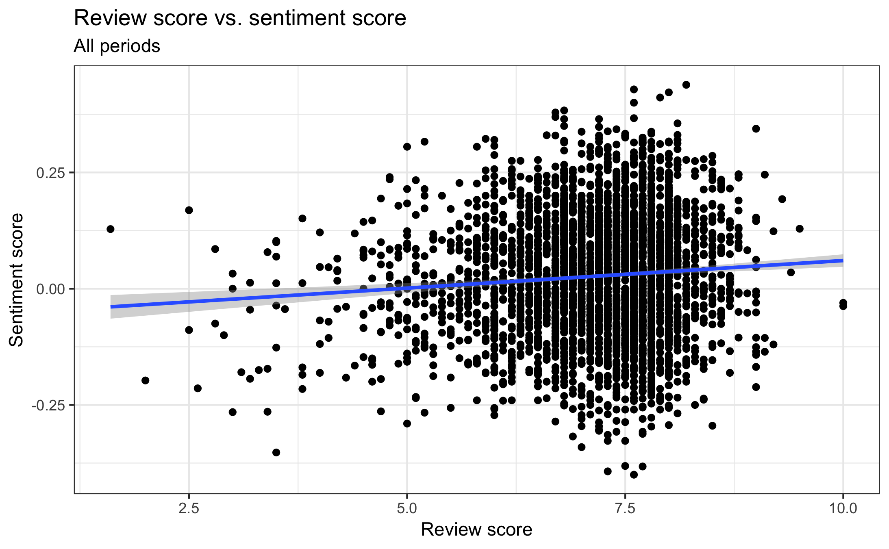
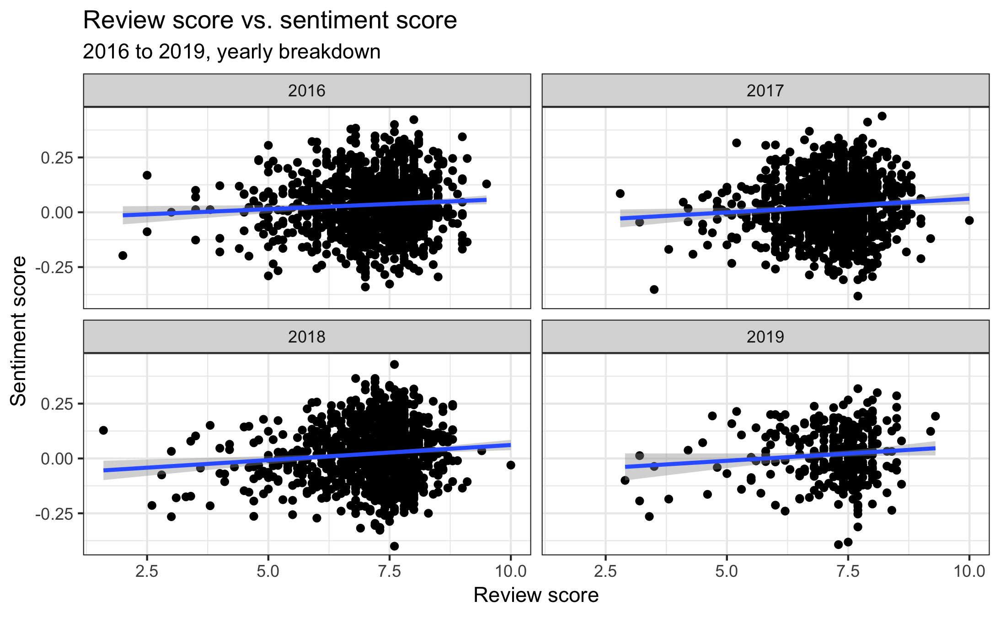
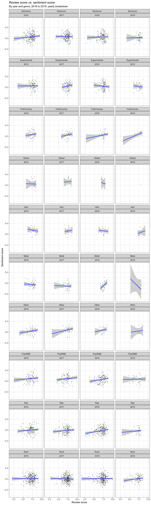
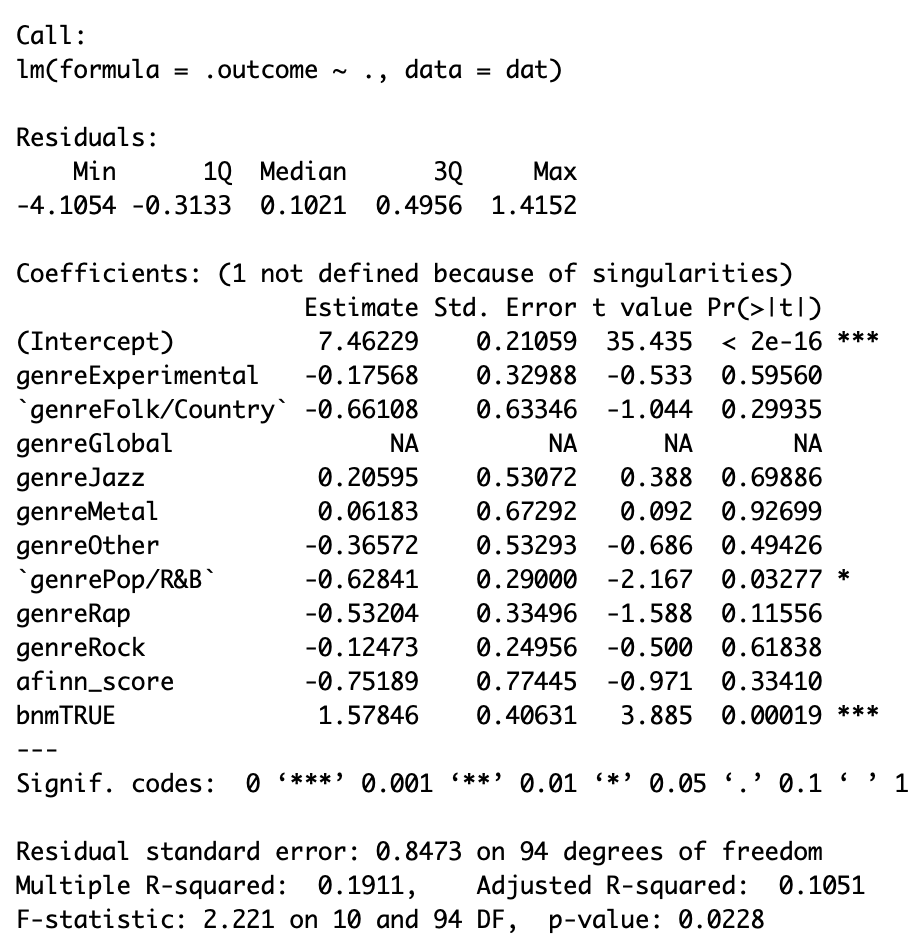
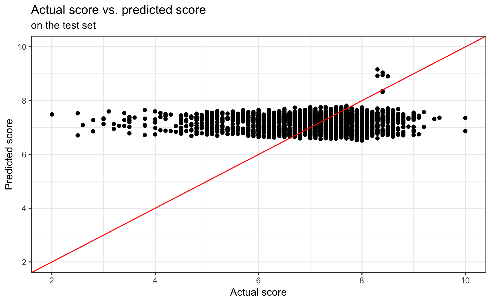
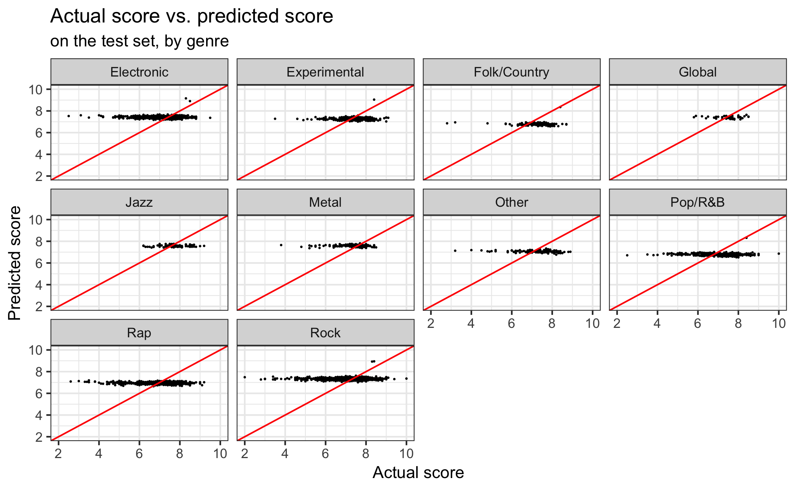
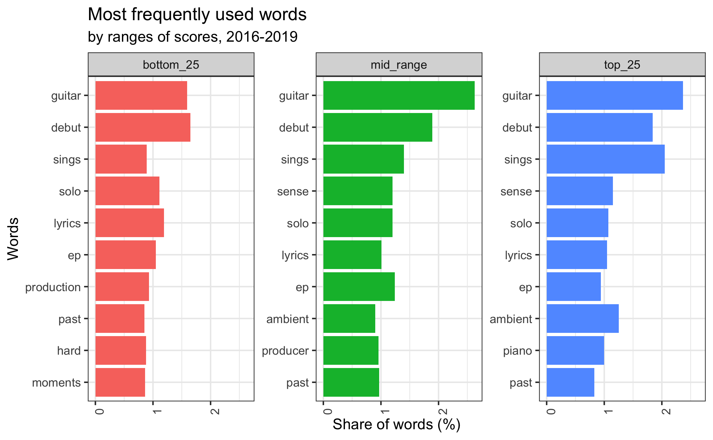
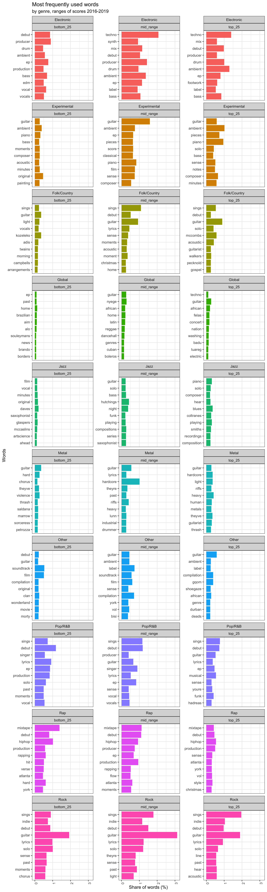
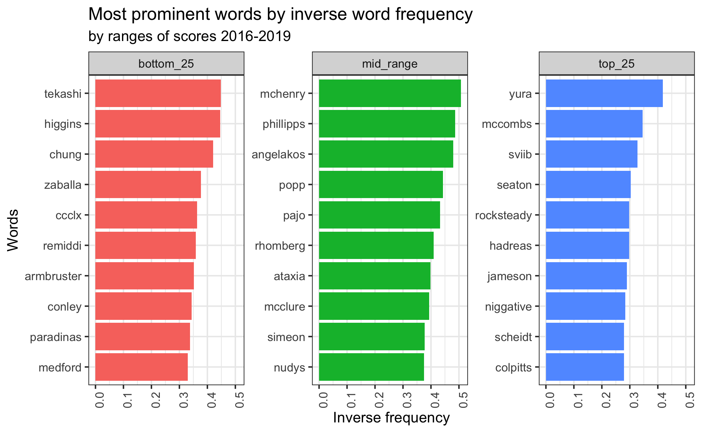

# Analysis of the sentiment and scoring of Pitchfork articles
This analysis aims to analyse the relationship between the review scores assigned to album reviews on the pitchfork.com website to the sentiment of the reviews written as well as to find clues on "what makes music good" based on the words used in the actual reviews.

The source data was generated via the **['Scraper'](scraper/scraper.Rmd)** file, while the actual analysis script is available here: **['Analysis'](analysis/analysis.Rmd)**.

## Results of the analysis
In the following we will outline the results for both the review score - sentiment score relationship, as well as the results of the word frequency analysis. We argue that the sentiment analysis based on the afinn sentiment dictionary does not show a clear relationship with the review scores in our data, while by the quality of music we find that there are differences, mostly across genres and which words are frequently used for low rated and high rated reviews by genre. At the end of the document we also provide those areas where we believe further analysis could be done in order to enhance the results.

## About the data
The data is sourced from the pitchfork.com website via scraping detailed in the aforementioned script. The database itself includes reviews from 2016 to 2019 mid-April, and each observation represents an individual album from the given artist. 

Features include:

- Name of the artist
- Name of the album
- Genre of the album
- Review score assigned to the album
- Text of the review
- Author of the reviews
- Title of the author
- Dummy variable on whether the album was "Best New Music", a tag assigned to the best albums
- Release year
- Review year

The details of the cleaning process are explained in the **['Analysis'](analysis/analysis.R)** script.

## Review scores vs sentiments - Sentiment analysis
Our initial hypothesis is that review scores should be reflected by the sentiment of the respective review's text. In order to see the relationship we have individually calculated the sentiment scores with the help of the afinn library. For each review we took the average sentiment score of the review based on the review text and compared that to the review score assigned by the author to the album. In addition to the common stop words we have used custom stop words as well that included those words that are part of any of the artists names, and which are generally related to the music industry and thus should have no meaningful sentiment in this context.

### Historical data
We start with the visual exploration of the potential relationship.

First we have visualised the relationship in the total database between review scores and sentiment scores. As it can be seen on the above picture, it seems that there could be a weak relationship between the two, although the sentiments scores are fairly scattered, with reviews around the median having sentiment scores ranging from very low to very high.

If we take a look at the breakdown by years, we can see that based on charts it looks the same, therefore we will not concentrate on the time dimension of the data.

Looking at the breakdown by date and genre is more interesting. We can see a higher variation in the slope depending on the genre and also the year - this is more meaningful for the genres with many observations, what is surprising is that in some cases the slopes are even negative, which implies that the sentiment score created is probably not a good feature for estimating review scores.

### OLS modelling
Next we turn to the modelling and create linear regression models that try to forecast review scores based on the following features:

- Sentiment score
- Genre (factor)
- Best new music tag (dummy)

We don't use any of the other variables, given that they factors, but the categories are not stable over time, which raises problems for the train - test split. For the modelling we apply 10-fold cross-validation on the training data.

Looking at the model results we can see that only the intercept, the Pop & RnB genre and the best new music tag features were significant at least a 95% level. The best new music tag is no surprise (given that it is only assigned to the best music, which thus has high score), but the significance of the Pop & RnB genre implies some level of negative bias towards this category, due to the negative coefficient. It is also interesting that the sentiment score itself was not signficiant even at a 90% level, thus it seems highly likely that modelling based on the sentiment score does not lead to success. 

If we look at the error measures, RMSE on the train set was 0.8, while RMSE on the test set was 0.94, and MAE on the train set was 0.54 with MAE on the test set was 0.69. This shows us that the model performed worse on the test set, and it might be a bit overfitted on the train data.

If we visualise the predicted and actual scores on the test set we can see that the predicted scores all fall between 6 and approximately 9, despite the actual scores ranging between 2 and 10. This chart also indicates that our model is not very good for predicting review scores of articles based on the genre, text and best new music tags of articles.

We can visualise the actual vs predicted results by genres as well. In this case we can't see any huge differences between the efficiency, the problem outlined above is present in the results in all of the genres.

### Potential shortcomings of the analysis
One shortcoming of our approach is the fact that we only used one sentiment lexicon for creating the sentiment score. It would be worthy checking the results based on other sentiment dictionaries, or creating averaged sentiment scores based on multiple dictionaries. 

## "What makes music good"? - Word frequency analysis
In the second part of the analysis we will try to get a sense on what makes music good. For this we analyze word counts in the reviews in order to see any patterns in word usage depending on the quality of the music (which we measure with the review score assigned). To do this we split the data into three parts, based on the 25th and 75th percentiles, thus the three groups represent the below average, average and above average rated music. We expect the results to show what elements are important (characterized by the word usage) for the differently rated albums.

### Normal word frequency
In order to get accurate word frequencies, we added certain words to our custom stop word dictionary, which we believe would not have a meaningful interpretation if included but are frequently present in the reviews (e.g. "makes").

First we look at the word frequency in the total dataset (separated by review scores). Interestingly most of the words are the same, which indicates that even words like "guitar", "debut" or "sings", which theoratically could be meaningful for the actual music, are all in the top 10 words used (although in the case of "sings" it seems to be more prominent in the top group then in the other two). It seems to make sense to focus on those words that are more unique to certain groups like "ambient", which is only in the top 10 in the average range and the above average range, or "piano" that is only part of the latter. This can imply that ambient albums using pianos are better regarded by the reviewers.

Next we go one step further and do the same analysis also divided by genres. Here we can find more prominent results, such as: 

- "EDM" and "vocals" being less favoured for electronic music, but "techno" is better regarded;
- in the case of experimental music "solo" seems to be good, but "acoustic" seems to be weak;
- for folk & country "debut" albums seem to perform better and "vocals" is on the weak side (although here it is likely that due to the low element count in the groups the results are in practice not very meaningful);
- for global music the word lists are very different, most likely due to the low element counts in the groups;
- in the case of jazz music doing "blues" seems to be a better choice than having a "saxophonist" (or more likely a good saxophonist is needed);
- for metal music "riffs" are frequent in average and above average albums, while the below average group is probably biased due to the low element count (or another explanation can be that doing some kind of magical metal indicated by the word "sorceress" is not much favoured);
- we don't look at other music due to its inconsistency as a genre;
- for pop & rnb "guitar" and "funk" are frequent in the average or better results while "solo" seems to be more frequented in lower rated reviews;
- for rap "verse" is more on the downside, while for some reason "christmas" is frequent in above average albums, however it is not easy to find a reasoning for this phenomenon;
- for rock "chorus" can be problematic, while "accoustic" is well regarded.

Based on the above we can see that depending on the genre different words are frequently used, so it could be worthy looking at sub groups instead of the whole dataset.

### Inverse word frequency

We also take a look at inverse word frequency, in order to see which words could be important based on this value for the different score ranges, however the results don't seem too meaningful and hard to put them in proper context.

### Potential shortcomings of the analysis
There are multiple potential shortcomings in this analysis. Firstly, the number of articles by genre is different, and the review scores - genre separation is based on the review scores of all data, therefore it might be more appropriate to separate the genres by the genre scores instead of the total score. Then, we can see that certain words could be added to the stop word dictionary in order to enhance results, such as "theyre" or "youre". Lastly, the inverse word frequency is calculated as the average of word frequencies in articles, instead of which taking the inverse word frequency with the articles in the three groups merged (by group) could yield better results.

## Recommended further analyses
There are several areas where the analysis could be expanded or improved. One of these areas would be tackling the shortcomings outlined earlier. Furthermore, even though based on the visualisation we decided not to treat the data by years, it could be interesting to check the relationship on a time series basis as well, possible with the data going back to a longer period of years. It could be also interesting to see how the data performs using bigrams, and which bigrams are frequented based on score and genre. Last, but not least, it would be interesting to check the differences by authors as well, which could help identifying personal styles for individual authors.