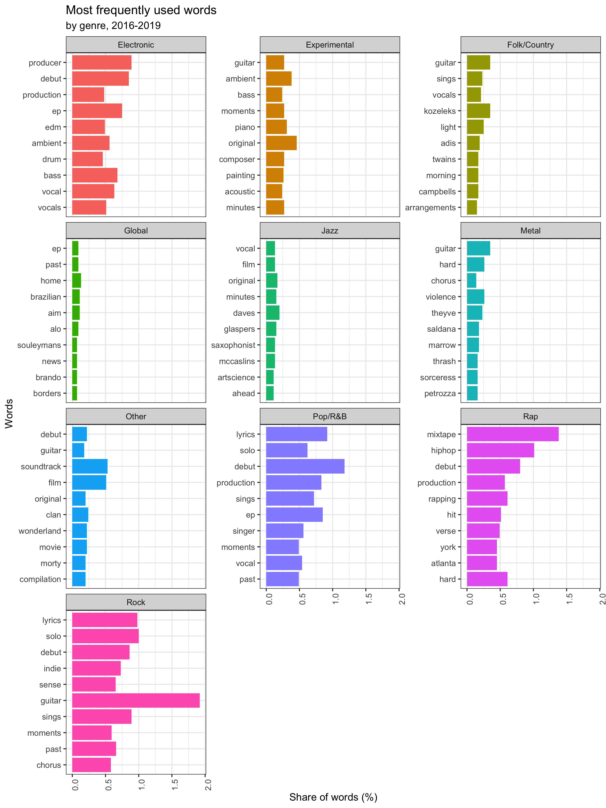

# Analysis of the sentiment and scoring of Pitchfork articles
This analysis aims to analyse the relationship between the review scores assigned to album reviews on the pitchfork.com website to the sentiment of the reviews written as well as to find clues on "what makes music good" based on the words used in the actual reviews.
The source data was generate via the **['Scraper'](scraper/scraper.Rmd)** file, while the actual analysis script is available here **['Analysis'](analysis/analysis.R)**.

## Results of the analysis
In the following we will outline the results for both the review score - sentiment score relationship, as well as the results of the word frequency analysis. We argue that the sentiment analysis based on the afinn sentiment dictionary does not show a clear relationship with the review scores in our data, while by the quality of music we find that XXX and XXX. At the end of the document we also provide those areas where we believe further analysis could be done in order to enhance the results.

## Review scores vs sentiments - Sentiment analysis
TBA

### Historical data

TBA

TBA

### OLS modelling

TBA

TBA

## "What makes music good"? - Word frequency analysis
TBA

### Normal word frequency

TBA

TBA

### Inverse word frequency

TBA

TBA

## Recommended further analyses
We believe XXX.